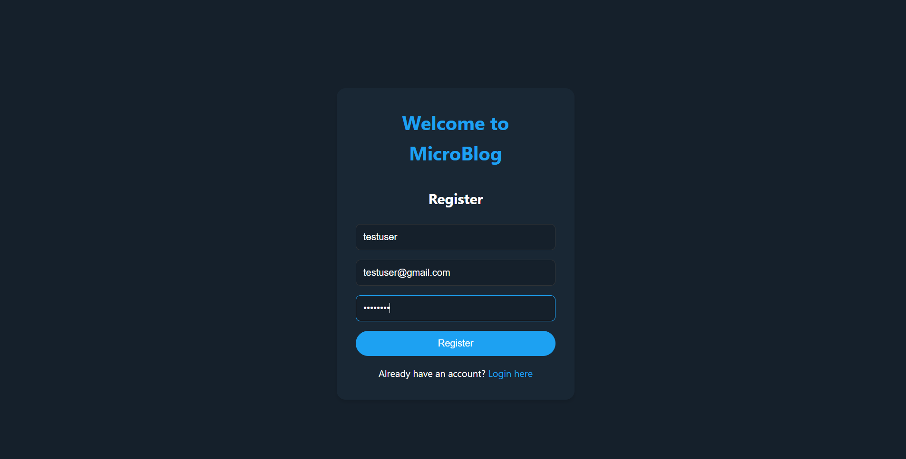
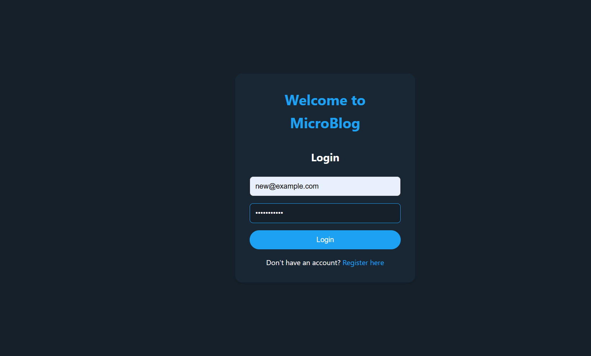
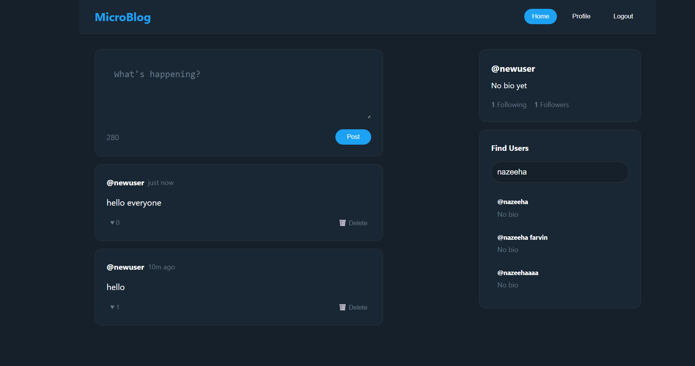
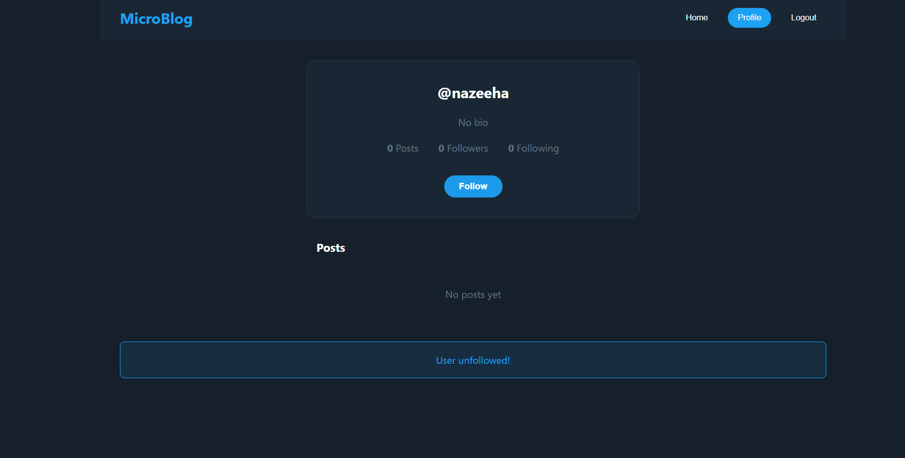

📘 MicroBlog

A simple micro-blogging application (similar to Twitter) built with Node.js, Express, MongoDB, and EJS.
Users can register, login, create posts, follow/unfollow other users, and view posts from people they follow.

🚀 Features

👤 User Registration & Login (Authentication with sessions)

📝 Create and delete posts

❤️ Like posts

👥 Follow/Unfollow other users

📄 View profiles with posts, followers, and following counts

🔍 Search users

🛠️ Tech Stack

Backend: Node.js, Express.js

Database: MongoDB (Mongoose ODM)

Frontend: EJS (Embedded JavaScript Templates), CSS

Authentication: Express-session / bcrypt

Deployment Ready: Works with MongoDB Atlas or local MongoDB

📸 Screenshots
🔹 Register Page

🔹 Login Page

🔹 Home Feed

🔹 Follow/Unfollow

🤝 Contributing

Fork the repo

Create your feature branch (git checkout -b feature-name)

Commit changes (git commit -m "Added feature")

Push to branch (git push origin feature-name)

Create a Pull Request

📜 License

This project is licensed under the MIT License.
